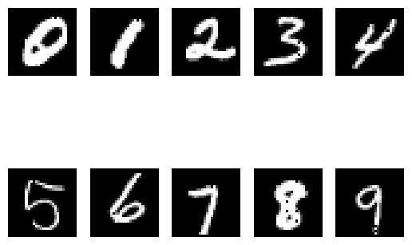
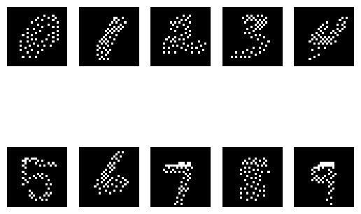

# Can GPTs classify MNIST digits?

## Introduction

Once upon a time, I was reading about GPT-3 and its capabilities. I was wondering if it can classify MNIST digits. I thought it would be interesting to see if it can do that. So, I decided to give it a try.

## Method

I took MNIST dataset (test split) and sampled 1000 images. The size of each image is 28x28. Feeding these images to GPT might not be a good idea because 784-d input is a bit to large.

Original MNIST image | Sampled MNIST image
:---------------------:|:---------------------:
 | 
